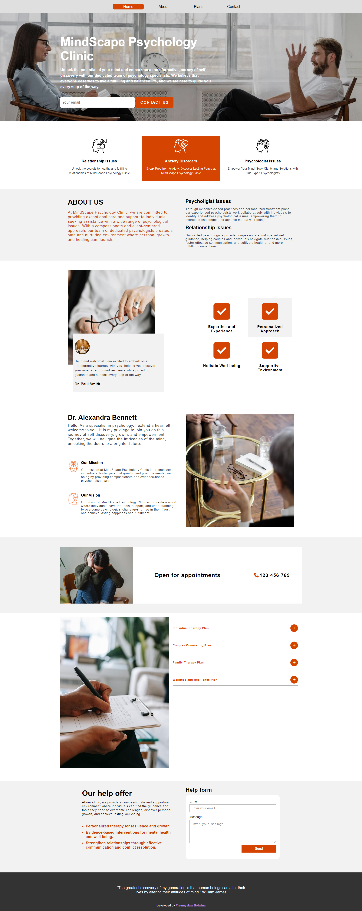
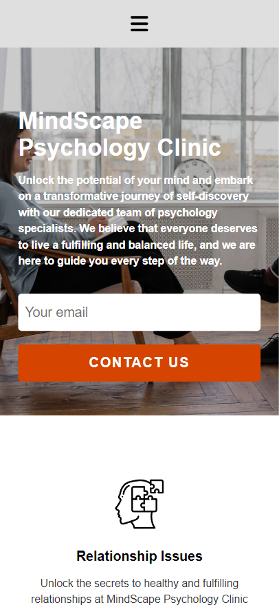

# Psychology specialists website with Vue.js

   

## Overview

The website, built with Vue.js and Sass, is designed for psychology specialists. Its purpose is to showcase my programming skills to future employers. It features a landing page where users can send emails and messages to the page owner. Currently, data is not sent to a server like Firebase, as my main focus is on front-end development. The website excels in its responsiveness, providing scrolling indicators that clearly show the user's current position on the page. It also prioritizes accessibility, featuring tabbable elements and excellent contrast. Furthermore, the website adopts a mobile-first approach, ensuring optimal performance on mobile devices.

## Screenshot

## Links

- GitHub repository: [https://github.com/WersV/psychology-specialist-website-vue](https://github.com/WersV/psychology-specialist-website-vue)
- GitHub Pages: [https://wersv.github.io/psychology-specialist-website-vue/](https://wersv.github.io/psychology-specialist-website-vue/)

## Author

- My GitHub profile - [Przemysław Botwina](https://github.com/WersV)
